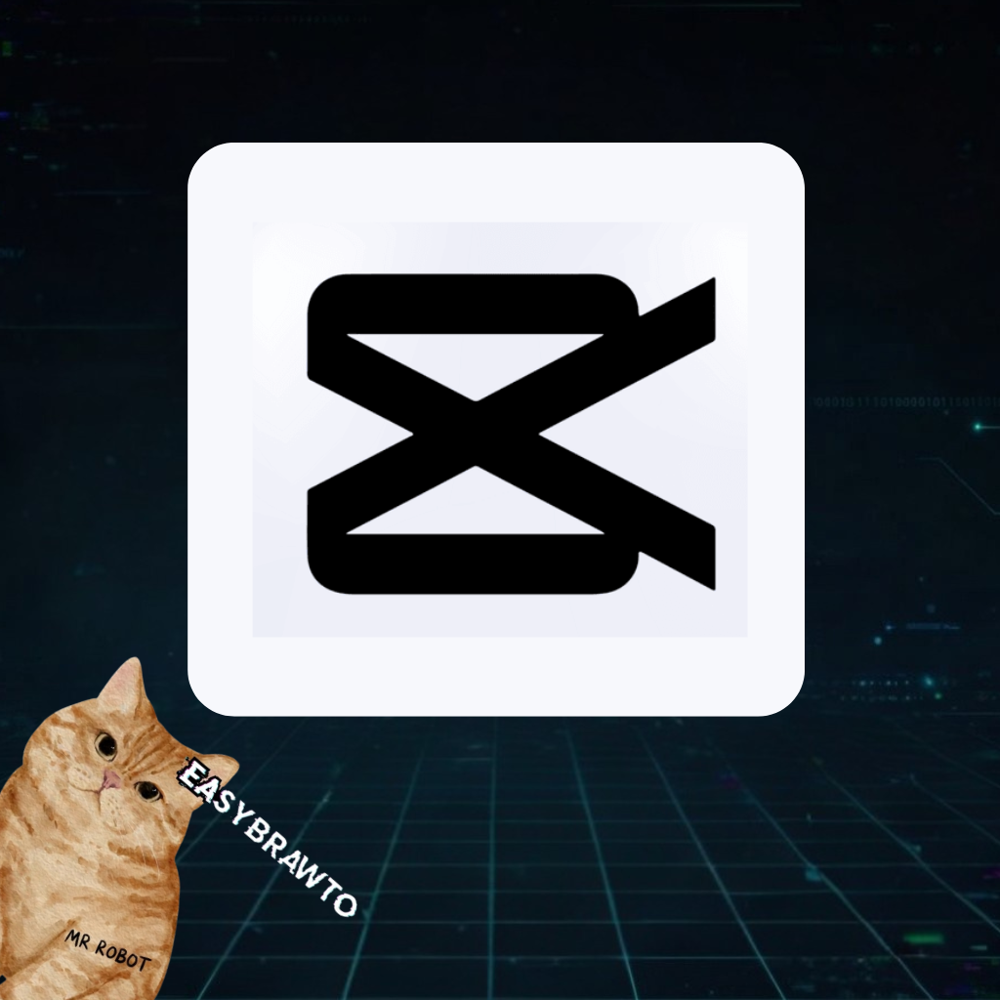

<div align="center">



# CapCut Auto Editor

**Automate your CapCut Desktop post-production — bulk apply zooms, effects, and transitions instantly**

*A personal project to speed up repetitive video editing — contributions welcome!*

[](https://github.com/Saimonsanbr/capcut-auto-editor/releases/latest)
[](LICENSE)
[](https://www.electronjs.org/)

<br/>

[**⬇ Download for macOS**](https://github.com/Saimonsanbr/capcut-auto-editor/releases/latest/download/CapCut-Auto-Editor-mac.dmg)
&nbsp;&nbsp;
[**⬇ Download for Windows**](https://github.com/Saimonsanbr/capcut-auto-editor/releases/latest/download/CapCut.Auto.Editor.Windows.exe
)

<br/>

</div>

---

## What is this?

CapCut Auto Editor is a desktop application that lets you batch process multiple CapCut projects in seconds. It completely automates the tedious post-production steps.

Instead of opening every project manually to apply zooms to photos and toss effects onto clips, you simply select your draft projects in this app, click **Edição Mágica**, and it manipulates the CapCut internal JSON timelines directly.

No manual clicking. No rendering bottleneck. Just instant timeline routing.

---

## Honest intro

This is a personal project. I built it because I needed to automate repetitive editing workflows on CapCut Desktop and there was no official API available.

It works by directly editing the secret `draft_info.json` and timeline metadata files that CapCut creates on your machine. It reconstructs the tracks, assigns random scale keyframes (zooms), handles non-16:9 overlays, and injects fade animations directly into the database.

It might be rough around the edges, and if CapCut changes their JSON schema radically, things might break. But for now, it saves hours of manual work. If you find it useful or want to add more effects, feel free to contribute!

---

## Quick start

### Using the App (Compiled)
**1. Download the installer** for your platform from the links above.

**2. Open the App:**
You will see a grid with all your local CapCut projects.

**3. Run Magic Edit:**
Select as many projects as you want and click the magic button. It will process everything in the background. Once finished, open CapCut and your timelines will be fully edited.

### Running from source (Development)

Requires [Node.js](https://nodejs.org/) installed.

```bash
git clone https://github.com/Saimonsanbr/capcut-auto-editor
cd capcut-auto-editor
npm install
npm start
```

---

## How it works under the hood

1. The app reads your local CapCut `Projects/com.lveditor.draft` folder.
2. It intelligently handles different CapCut schema versions depending on your OS and updates:
   - **Modern/Windows pattern**: Finds `draft_content.json` directly in the project root.
   - **Legacy/macOS pattern**: Follows `timeline_layout.json` to find `draft_info.json` inside the `Timelines/` directory.
3. It creates a complete backup of your timeline JSON just in case.
4. It iterates over your `main_video_track`, separates elements, and recalculates times.
5. It injects new UUIDs for VFX materials (like Vignettes, Fades, and Old Comedy effects) directly into the CapCut Cache pool.
6. It syncs the modified timestamps with `root_meta_info.json` so the CapCut UI recognizes the changes instantly upon opening.

---

## Building from source

Use `electron-builder` to package the app for your system:

**For macOS (creates a .dmg and .app in `/dist`):**
```bash
npm run build
```

**For Windows (creates a .exe in `/dist`):**
```bash
npm run build:win
```
*(Note: Compiling for Windows is best done on an actual Windows machine to avoid native dependency issues).*

---

## Customizing Effects (Advanced)

By default, the app looks for effects in a local `assets/effects/` folder. If they aren't found, it gracefully falls back to your machine's CapCut installation Cache directory (`AppData/Local/...` on Windows or `Library/Containers/...` on Mac).

To add custom VFX or Transitions, edit `src/backend/effects.js` and map the CapCut resource IDs to your new logic.

---

## License

MIT.
